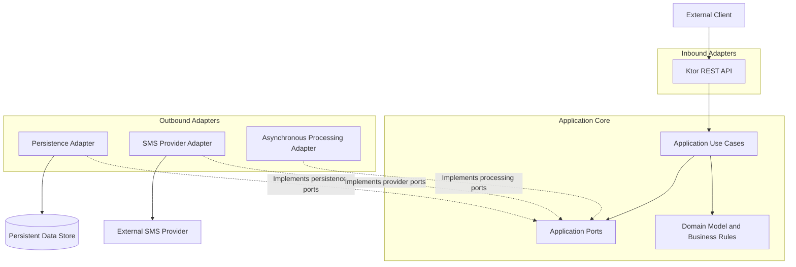

# Application Architecture

## 1. Purpose

This document defines the internal application boundaries, responsibilities, and dependency rules of the Enterprise Notification Platform.

It establishes how the REST API, application use cases, domain model, and infrastructure adapters collaborate while preserving Clean Architecture principles.

The objective is to make business behavior independently testable, infrastructure replaceable, and future changes manageable without introducing unnecessary abstraction.

## 2. Architectural Approach

The application will follow Clean Architecture, supported by Ports and Adapters (Hexagonal Architecture).

The design separates four principal areas:

1. **Domain:** Core business concepts, invariants, and lifecycle rules.
2. **Application:** Use cases that coordinate domain behavior and enforce application-level workflows.
3. **Inbound adapters:** Interfaces through which external actors invoke application use cases, initially the REST API.
4. **Outbound adapters:** Implementations that connect application-defined ports to persistence, SMS providers, and asynchronous processing mechanisms.

These are logical boundaries, not necessarily separate deployable services or independently managed projects.

The initial implementation will remain a single deployable Kotlin application built with Ktor.

## 3. Logical Architecture

The diagram represents logical dependencies and responsibilities rather than a prescribed package structure.

The critical rule is that dependencies point inward: the domain and application core must not depend on Ktor, database libraries, provider SDKs, or message-broker APIs.

Infrastructure adapters depend on the interfaces they implement. The application core defines the contracts it needs.

## 4. Domain Layer

The domain layer contains the platform's core business concepts and rules.

Its responsibilities include:

* Representing tenants and notifications.
* Defining notification lifecycle states and permitted transitions.
* Enforcing domain invariants.
* Representing delivery attempts and meaningful processing outcomes.
* Defining provider-independent concepts for submission and delivery results.
* Rejecting invalid business-state transitions.

The domain layer must not perform HTTP handling, database access, provider communication, or framework-specific dependency injection.

Domain behavior should be testable using ordinary unit tests without starting Ktor, connecting to a database, or contacting an external provider.

The domain layer must not become a passive collection of data classes if doing so would leave important business invariants scattered across application services.

## 5. Application Layer

The application layer coordinates use cases and defines the workflows through which the platform's business capabilities are executed.

It uses domain behavior and application-defined ports to perform operations without depending on their infrastructure implementations.

Initial use cases include:

* Submit a notification.
* Retrieve notification status.
* Begin processing an eligible notification.
* Record a provider submission outcome.
* Record a delivery-status update.
* Schedule or initiate a retry according to the applicable policy.
* Reconcile an uncertain processing outcome where supported.
* Retrieve tenant-scoped notification information.

These are logical use cases. The final class names, interfaces, and method signatures will be determined during implementation design.

### 5.1 Responsibilities

The application layer must:

* Coordinate the steps of each use case.
* Apply authorization-relevant application rules using the established security context.
* Invoke domain behavior to enforce business invariants.
* Define transaction and consistency requirements through appropriate ports.
* Coordinate persistence and provider interactions.
* Translate application outcomes into stable results that inbound adapters can present.
* Preserve notification lifecycle and idempotency guarantees.
* Avoid leaking framework or infrastructure types into application contracts.

### 5.2 Use Case Boundaries

Each use case should represent a meaningful application operation rather than a thin wrapper around a database query or provider SDK call.

For example, notification submission coordinates request validation, tenant ownership, idempotency, and durable acceptance. It must not directly expose database implementation details to the REST layer.

The use case must also preserve the agreed acceptance semantics: the API must not report successful asynchronous acceptance until the notification has been durably recorded and a recoverable processing path exists.

The precise transaction boundary and processing-dispatch mechanism remain subject to the persistence and asynchronous-processing designs.

## 6. Inbound Adapters

Inbound adapters translate external requests into application operations.

The initial inbound adapter is the Ktor REST API.

Its responsibilities include:

* Defining HTTP routes and request/response representations.
* Parsing and validating request syntax.
* Extracting authentication credentials and establishing security context.
* Applying HTTP-level concerns such as headers and status codes.
* Invoking the appropriate application use case.
* Mapping application outcomes to documented API responses.
* Producing structured errors and correlation identifiers.

The REST adapter must not own notification lifecycle rules, persistence transactions, retry policy, or provider-specific behavior.

Ktor types must not be required by domain entities or application use-case contracts.

## 7. Outbound Ports and Adapters

Outbound ports are interfaces defined by the application core to express capabilities it requires from infrastructure.

Adapters implement these ports using concrete technologies.

The following are initial logical port categories. Their exact interfaces will be defined when the relevant design is sufficiently detailed.

### 7.1 Notification Persistence

The application needs a way to store and retrieve notifications while preserving tenant scope, lifecycle integrity, and concurrency requirements.

The persistence adapter implements the required contracts using the selected data-access technology.

The domain and application layers must not depend on database-specific entities or ORM APIs.

### 7.2 Idempotency

The application needs to identify repeated submissions and coordinate concurrent requests that use the same applicable idempotency key.

The implementation must support durable, concurrency-safe idempotency rather than relying on an in-memory cache as the authoritative record.

The precise transaction boundaries and uniqueness constraints will be defined by the persistence design.

### 7.3 Provider Integration

The application needs a provider-independent contract for submitting SMS notifications and interpreting provider outcomes.

The provider adapter translates between application-level requests and provider-specific protocols and response models.

Provider SDK types and provider-specific response codes must remain outside the domain model.

### 7.4 Asynchronous Processing

The application needs a reliable mechanism to make accepted notifications available for processing and recover unfinished work.

The relevant ports and adapters must preserve durable acceptance and support recovery after failures.

The exact mechanism—such as database-backed work discovery or a transactional outbox with polling—will be determined through the asynchronous-processing and persistence designs.

### 7.5 Time and Identifiers

Where deterministic tests or consistent application behavior require it, the application should depend on abstractions for obtaining the current time and generating identifiers rather than embedding uncontrolled infrastructure dependencies throughout business logic.

These abstractions should be introduced where they provide a clear testing or correctness benefit, not merely to increase the number of interfaces.

## 8. Dependency Rules

The implementation must follow these rules:

1. The domain layer must not depend on the application framework or infrastructure.
2. The application layer may depend on the domain layer and on ports defined for its required capabilities.
3. Inbound adapters depend on application use cases.
4. Outbound adapters implement application-defined ports.
5. Infrastructure-specific models must not leak into domain contracts.
6. Framework-specific dependency injection must remain outside the domain.
7. The REST layer must not bypass application use cases to manipulate persistent state directly.
8. Provider responses must be mapped into provider-independent application or domain outcomes.
9. Tenant authorization and ownership constraints must be enforced consistently across application operations and persistence access.
10. Dependency injection and application startup must compose the concrete implementations at the application boundary.
11. Domain and application tests must not require production infrastructure.
12. New abstractions must have a clear responsibility and must not be introduced solely for speculative future requirements.

These rules should be reinforced through package organization, code review, and automated tests where practical.

## 9. Error Handling

The application must distinguish between:

* Invalid client input.
* Authentication or authorization failures.
* Idempotency conflicts.
* Missing resources or resources not accessible within the caller's tenant context.
* Retryable infrastructure failures.
* Non-retryable processing failures.
* Uncertain external provider outcomes.
* Unexpected application errors.

Application use cases should expose meaningful, provider-independent outcomes or errors. The REST adapter is responsible for mapping them to the documented HTTP error representation.

Internal exceptions, SQL errors, and provider SDK exceptions must not be returned directly to clients.

Error handling must preserve enough diagnostic information for investigation without exposing secrets or sensitive implementation details.

The exact error taxonomy and HTTP mappings will be finalized alongside the API contract.

## 10. Transactions and External Side Effects

The application layer must coordinate state changes and external side effects without assuming they can be committed atomically.

Database changes can be governed by database transactions. An external SMS submission generally cannot participate in the same transaction.

Consequently:

* Durable acceptance and idempotency must be coordinated consistently.
* Processing work must remain recoverable after interruption.
* Provider submission attempts must be recorded sufficiently to support investigation and reconciliation.
* A timeout must not automatically be interpreted as proof that no external side effect occurred.
* Retries must follow documented rules and account for duplicate-delivery risk.

The persistence and asynchronous-processing designs must specify how these guarantees are implemented.

## 11. Testing Strategy

The architecture should support a layered testing strategy.

### 11.1 Domain Unit Tests

Verify lifecycle transitions, tenant ownership invariants, domain validation, and other business rules without external dependencies.

### 11.2 Application Unit Tests

Verify use-case orchestration using controlled test doubles for persistence, idempotency, provider integration, and other required ports.

### 11.3 Adapter Tests

Verify REST request/response mapping, persistence behavior, provider response translation, and asynchronous-processing integration.

### 11.4 Integration Tests

Verify important cross-boundary behavior, particularly durable acceptance, idempotency under concurrency, tenant isolation, lifecycle consistency, and recovery of unfinished work.

### 11.5 Contract and Failure Tests

Verify that API and provider integration contracts are interpreted correctly, including invalid responses, timeouts, retries, and uncertain external outcomes.

Tests must validate actual guarantees rather than merely confirm that individual classes execute without errors.

## 12. Kotlin and Ktor Considerations

Kotlin and Ktor are implementation choices, not architectural boundaries.

Ktor should be used for HTTP concerns and application startup. It must not become a mandatory dependency for the domain model.

Kotlin language features should be used to express domain concepts clearly and to make invalid states harder to represent where practical.

The implementation should favor explicit dependencies and readable control flow over unnecessary framework magic or abstraction.

The final package and module organization will be documented before or during the implementation foundation work.

## 13. Open Questions

The following items require further design:

1. Which application ports are needed for durable acceptance and idempotency?
2. What transaction boundary should the notification-submission use case require?
3. How will the selected asynchronous-processing mechanism integrate with application use cases?
4. How should provider outcomes and uncertain results be represented in application contracts?
5. Which application-level errors and result types are needed for a stable API contract?
6. Which automated checks will enforce the most important dependency rules?

These questions will be resolved alongside persistence, asynchronous processing, security, and API design.

## 14. Relationship to Other Architecture Artifacts

This document is derived from:

* `docs/requirements/requirements-baseline.md`
* `docs/architecture/architecture-drivers-and-principles.md`
* `docs/architecture/system-context.md`
* `docs/architecture/container-architecture.md`
* `docs/architecture/domain-model.md`

It establishes the internal boundaries for subsequent persistence, asynchronous-processing, security, reliability, and implementation-design work.

## 15. Status

**Status:** Proposed for architecture review.

The logical application boundaries and dependency rules are defined. Detailed port contracts, transaction boundaries, concrete package organization, and technology-specific implementations remain subject to subsequent design decisions.
