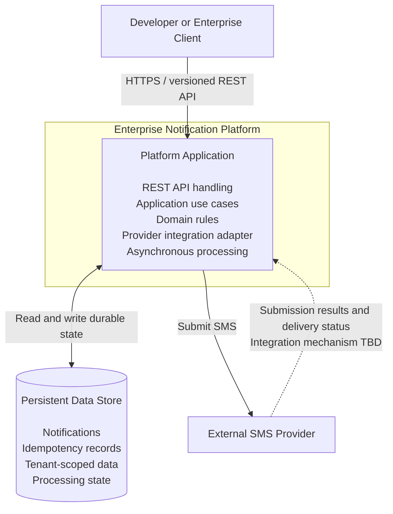

# Container Architecture

## 1. Purpose

This document defines the major runtime responsibilities and data-store boundaries of the Enterprise Notification Platform. It establishes how the platform's external interface, asynchronous notification processing, persistent state, and external SMS provider integration relate to one another.

The architecture is intended to support a maintainable V1 implementation while preserving clear boundaries for future evolution.

## 2. Architectural Context

The architecture is governed by the following decisions and constraints:

* The platform exposes a versioned REST API as its primary interface.
* SMS is the initial notification channel.
* Notification processing is asynchronous.
* Accepted notifications must be durably recorded and recoverable after failures.
* The initial application uses a single deployable application with explicit separation between API handling and asynchronous processing.
* Business rules remain independent of the web framework, persistence technology, asynchronous processing mechanism, and SMS provider.
* Tenant isolation and durable idempotency are fundamental requirements.
* Additional infrastructure must be justified by concrete reliability, operational, or business requirements.

This document describes logical runtime responsibilities and their relationships. It does not prescribe a particular cloud provider, deployment platform, database product, or message broker.

## 3. Container Architecture View

The following diagram represents the proposed V1 architecture at a logical runtime level. API handling and asynchronous processing are responsibilities within the same deployable application; they are not separate deployable services.

The diagram intentionally groups the API and asynchronous processing responsibilities inside one application boundary. Their internal execution model and scheduling mechanism will be defined in subsequent architecture work.

The persistent data store is shown separately because durable application state must survive application restarts and process failures. Its technology remains subject to an explicit architecture decision.

## 4. Runtime Responsibilities

### 4.1 Platform Application

The Platform Application is the initial deployable application. It exposes the REST API and executes the application and domain behavior needed to manage notifications.

Its responsibilities include:

* Exposing versioned REST endpoints.
* Authenticating requests and establishing tenant context.
* Validating notification requests and enforcing application rules.
* Enforcing idempotency for notification submissions.
* Persisting accepted notifications and associated processing state.
* Coordinating asynchronous notification processing.
* Invoking the SMS provider integration through an abstraction.
* Recording lifecycle transitions and processing outcomes.
* Returning notification status and structured API errors.
* Emitting appropriate logs, metrics, traces, and correlation identifiers.

The application must maintain clear internal boundaries. Web-framework concerns, domain rules, persistence implementations, and provider-specific behavior must not become tightly coupled.

### 4.2 API Handling

API handling is a logical responsibility within the Platform Application.

It receives client requests, authenticates and authorizes them, validates their content, invokes application use cases, and returns appropriate HTTP responses.

For asynchronous notification submission, a successful acceptance response must only be returned after the platform has durably recorded the accepted notification and established a recoverable path for processing it.

The API must not equate successful request acceptance with successful provider submission or final delivery.

### 4.3 Asynchronous Notification Processing

Asynchronous notification processing is a logical responsibility within the same deployable application for V1.

It retrieves eligible work, coordinates processing attempts, invokes the provider integration, records lifecycle transitions, and handles retryable or terminal failures according to defined policies.

The processing design must address:

* Recovery of accepted notifications after application restarts.
* Coordination between API acceptance and background processing.
* Concurrent processing and prevention of conflicting state transitions.
* Retry eligibility, attempt tracking, and backoff.
* Provider timeouts and uncertain external outcomes.
* Prevention of avoidable duplicate processing and duplicate external submissions.
* Recovery of work that remains unfinished after a process failure.

The mechanism used to identify and dispatch pending work remains an explicit architecture decision. A database-backed approach and a dedicated message broker must be evaluated against the platform's reliability and operational requirements before a technology is selected.

### 4.4 Persistent Data Store

The persistent data store is responsible for durable application state.

Its logical data responsibilities include:

* Tenant and credential-related records, subject to the security design.
* Notification records and lifecycle state.
* Idempotency records and their associated request outcomes.
* Processing attempts and retry-related state.
* Any durable coordination records required by the selected asynchronous processing design.

The data model must support tenant-scoped access, appropriate uniqueness constraints, concurrency-safe state changes, and the transaction boundaries required for reliable acceptance and idempotency.

The choice of database technology and the exact schema are deferred to the persistence architecture and associated decision records.

### 4.5 SMS Provider Integration

The Platform Application communicates with an external SMS provider through a provider-independent application boundary.

Provider-specific request formats, credentials, response codes, and delivery-status mechanisms must remain isolated within the provider integration adapter.

The integration must distinguish between:

* A request rejected before provider submission.
* A submission accepted by the provider.
* A confirmed delivery outcome reported by the provider.
* A confirmed delivery failure.
* An uncertain outcome where the platform cannot yet determine whether the provider accepted the request.

An uncertain outcome must not automatically be treated as a safe-to-retry failure. The handling policy must account for the risk of duplicate messages.

The initial provider and its capabilities will be selected and documented separately.

## 5. Dependency and Communication Rules

The architecture must follow these rules:

1. The domain model must not depend on the REST framework, database implementation, asynchronous processing technology, or SMS provider SDK.
2. Application use cases coordinate domain behavior through defined interfaces.
3. Infrastructure adapters implement the interfaces required by the application and domain.
4. The REST API is an inbound adapter; it must not become the owner of business rules.
5. Persistence and provider integration are outbound infrastructure concerns.
6. Tenant authorization must be enforced before tenant-owned data is accessed or modified.
7. External provider responses must be validated and correlated with the relevant notification and processing attempt.
8. The application must not depend on an in-memory queue as the sole record of accepted work.
9. A process restart must not make durably accepted notifications undiscoverable.
10. Material changes to deployment boundaries or communication mechanisms require documented architectural justification.

## 6. Durability and Transaction Boundaries

The architecture must preserve a reliable relationship between accepting a notification and making it available for asynchronous processing.

The acceptance flow must not leave a notification durably accepted while losing the only record that it needs to be processed.

The detailed persistence design must establish how notification state, idempotency records, and any processing-dispatch records are committed consistently. The selected design must also address concurrent submissions using the same idempotency key.

The platform must distinguish between database transactions it can control and external provider operations it cannot include in the same transaction. This distinction is essential when recovering from timeouts or failures that occur after a provider may have accepted a request.

The exact transactional pattern and processing coordination mechanism remain subject to the persistence and asynchronous-processing architecture decisions.

## 7. Deployment Approach

V1 will begin with one deployable Platform Application and a persistent data store.

API handling and asynchronous notification processing will have explicit internal boundaries, even though they initially share an application deployment.

This approach reduces early operational complexity while preserving a path to future separation if independent scaling, fault isolation, deployment cadence, or other demonstrated requirements justify it.

The initial architecture does not mandate separate API and worker services, a dedicated message broker, Kubernetes, or a microservices topology.

Any future separation must preserve durable notification acceptance, tenant isolation, lifecycle consistency, and reliable recovery.

## 8. Security Considerations

The architecture must account for the following security requirements:

* All external API communication uses HTTPS.
* Machine-to-machine authentication uses API keys, with credential storage and verification defined in the security design.
* Tenant identity is derived from authenticated context rather than trusted request-supplied tenant identifiers.
* Access to tenant-owned records is restricted to the authorized tenant.
* Provider credentials and other secrets are protected and excluded from logs.
* Delivery-status callbacks, if supported by the selected provider, must be authenticated or otherwise verified according to the provider's security capabilities.
* Logs and telemetry must not unnecessarily expose secrets or sensitive notification content.

The detailed authentication, authorization, credential lifecycle, and provider-callback controls are defined by the security architecture.

## 9. Reliability and Observability

The architecture must support operational diagnosis and recovery without relying on transient process memory as the source of truth.

The implementation must provide the means to identify notification state, processing attempts, failures, and relevant provider interactions.

Logs, metrics, traces, and correlation identifiers must help operators investigate failures while minimizing exposure of sensitive data.

The reliability design must define recovery behavior for application restarts, persistence failures, provider outages, processing interruptions, and ambiguous provider outcomes.

Specific service-level objectives, alert thresholds, and operational procedures will be documented as the reliability design matures.

## 10. Open Architecture Decisions

The following decisions remain open and must be resolved through explicit analysis and decision records:

1. Which persistence technology best supports the required transaction, uniqueness, concurrency, and operational characteristics?
2. Should V1 use database-backed work discovery, a transactional outbox with polling, or a dedicated message broker?
3. How will accepted work be claimed safely by concurrent processing executions?
4. How will retry scheduling and recovery of unfinished work be implemented?
5. Which SMS provider will be selected, and how will submission results and delivery-status updates be received?
6. How will uncertain provider outcomes be reconciled while minimizing duplicate delivery?
7. Which deployment and operational controls are necessary for the initial application?

These decisions must be evaluated against the requirements baseline, operational complexity, reliability, cost, and expected evolution of the product.

## 11. Relationship to Other Architecture Artifacts

This document is derived from:

* `docs/requirements/requirements-baseline.md`
* `docs/architecture/architecture-drivers-and-principles.md`
* `docs/architecture/system-context.md`

It provides a foundation for:

* Domain model and lifecycle design.
* Application architecture and dependency direction.
* Persistence architecture.
* Asynchronous processing design.
* Security architecture.
* Reliability and observability design.
* Architecture Decision Records.

## 12. Status

**Status:** Proposed for architecture review.

The initial runtime boundary and principal responsibilities are defined. Persistence technology, asynchronous coordination, provider selection, and related reliability mechanisms remain subject to explicit architecture decisions.
