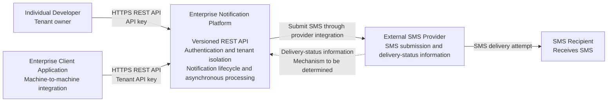

# System Context

## 1. Purpose

This document defines the system boundary of the Enterprise Notification Platform, the external actors and systems that interact with it, and the principal relationships between them.

It establishes the platform's place within its operating environment before internal containers, components, and implementation details are defined.

## 2. Scope

This document describes the initial version (V1) of the platform, with a versioned REST API as its primary interface and SMS as its initial notification channel.

It focuses on externally visible responsibilities and interactions. It does not prescribe the internal component structure, deployment topology beyond the agreed initial single-deployable-application direction, or specific infrastructure technologies.

## 3. System Context Diagram

The following C4-style system context diagram represents the principal V1 interactions.

The platform is represented as a single system because this is a system context view, not an internal component or deployment diagram. The responsibilities listed inside the platform box are descriptive, not separate deployable services.

The delivery-status interaction is conditional on the selected provider's capabilities and the integration mechanism determined during detailed architecture design.

## 4. External Actors and Systems

### 4.1 Individual Developer

An individual developer integrates an application with the platform to submit SMS notifications and retrieve notification status.

The developer operates within a tenant context and uses an API key to authenticate machine-to-machine requests.

### 4.2 Enterprise Client Application

An enterprise application integrates with the platform to submit SMS notifications and retrieve their status.

The enterprise may have multiple applications or credentials associated with its tenant. Each request must be authorized against the tenant context established by the authenticated credential.

Enterprise users and administrators may require human authentication and role-based access control in future administrative interfaces. The dashboard is outside the initial V1 interface scope.

### 4.3 Enterprise Notification Platform

The platform accepts authorized notification requests, validates them, establishes their tenant ownership, and manages their lifecycle.

Its responsibilities include:

* Exposing a versioned REST API.
* Authenticating requests and enforcing tenant isolation.
* Applying notification-submission and idempotency rules.
* Persisting accepted notification state and supporting recoverable asynchronous processing.
* Coordinating notification submission through an SMS provider integration.
* Tracking notification lifecycle transitions and delivery attempts.
* Exposing notification status through the API.
* Supporting operational investigation through appropriate logs, metrics, tracing, and correlation identifiers.

The platform remains responsible for its notification records and lifecycle semantics. An external provider's response is evidence about a submission or delivery outcome, not a replacement for the platform's own state management.

### 4.4 External SMS Provider

The SMS provider is responsible for accepting SMS submission requests and interacting with its downstream delivery infrastructure.

Depending on provider capabilities and the eventual integration design, it may report submission results and subsequent delivery-status information.

The provider is an external dependency. The platform must isolate provider-specific behavior behind an abstraction so that provider implementation details do not become domain-level dependencies.

Provider selection, delivery-status integration, timeout handling, retry policies, and treatment of uncertain outcomes remain architecture decisions to be documented separately.

### 4.5 SMS Recipient

The SMS recipient receives an SMS through the provider's delivery infrastructure.

The recipient is not necessarily a registered platform user and does not directly participate in the platform's API authentication or tenant authorization.

A submission accepted by a provider does not, by itself, establish that the recipient received the message. Delivery status must reflect the evidence available from the provider.

## 5. System Boundary and Responsibilities

The platform owns:

* Notification request validation and acceptance semantics.
* Tenant ownership and authorization of tenant-scoped resources.
* Notification identifiers, idempotency behavior, and lifecycle records.
* Coordination of asynchronous processing, retries, and recovery.
* Provider-independent notification behavior.
* The API representation of notification status and errors.
* Operational records needed to investigate processing outcomes.

External systems own their respective responsibilities:

* Client applications initiate requests and supply notification content.
* The SMS provider handles provider-side submission and downstream delivery.
* The recipient's carrier, device, and network environment influence final delivery outcomes.

The platform must not represent provider acceptance as confirmed delivery or promise successful delivery where the downstream outcome is outside its control.

## 6. Trust Boundaries

### 6.1 Client-to-Platform Boundary

Client applications are outside the platform's trust boundary. Requests must be authenticated, validated, and authorized before protected operations are performed.

Tenant identity must be derived from the authenticated credential or security context. A tenant identifier supplied in request data must not independently grant access to that tenant's resources.

### 6.2 Platform-to-Provider Boundary

The SMS provider is an external system and must not be treated as inherently trustworthy.

Provider responses and delivery-status information must be validated, correlated with the relevant notification or delivery attempt, and handled according to documented failure semantics.

Provider credentials and other secrets must be protected in configuration and excluded from logs.

### 6.3 Platform Data Boundary

Notification data and tenant-owned records must remain isolated according to the authenticated tenant context.

Operational telemetry must support diagnosis without unnecessarily exposing credentials or sensitive notification content.

## 7. V1 Scope and Future Evolution

### Included in V1 context

* Individual developers and enterprise client applications.
* A versioned REST API.
* API-key authentication for machine-to-machine access.
* Tenant-scoped notification submission and status retrieval.
* SMS as the initial notification channel.
* Asynchronous processing and lifecycle tracking.
* Integration with an external SMS provider.

### Deferred or subject to later approval

* A dashboard and broader human-facing administration interface.
* Additional notification channels.
* Scheduled notifications.
* Customer-facing webhooks.
* Provider failover and multi-provider routing.
* Independently deployable API and worker services.

Future capabilities may influence internal boundaries, but they do not justify adding unnecessary infrastructure to V1. Any material change to the agreed deployment approach must be supported by a documented architectural decision.

## 8. Assumptions and Open Questions

The following items remain unresolved at this stage and must be addressed by the relevant architecture artifacts or decision records:

1. Which SMS provider will be used initially?
2. How will the provider report delivery status: callbacks, polling, or another supported mechanism?
3. Which persistence technology and transaction boundaries will support durable acceptance and idempotency?
4. Which asynchronous processing mechanism will be used to recover and process accepted notifications reliably?
5. How will provider timeouts and ambiguous submission outcomes be reconciled without introducing avoidable duplicate deliveries?
6. Which operational controls will be needed for credentials, provider outages, and tenant-level usage limits?

These questions are intentionally left open rather than being resolved prematurely in a system context document.

## 9. Relationship to Other Architecture Documents

This document is derived from `docs/requirements/requirements-baseline.md` and is governed by `docs/architecture/architecture-drivers-and-principles.md`.

It provides the context for subsequent work on:

* Container and component architecture.
* Domain model and notification lifecycle.
* Application architecture and dependency direction.
* Persistence and asynchronous processing.
* Security and tenant isolation.
* Reliability, observability, and provider integration.
* Architecture Decision Records.

## 10. Status

**Status:** Proposed for architecture review.

The system boundary and principal V1 relationships are defined. The open questions listed above remain subject to subsequent architecture analysis and documented decisions.
